# デザインパターンをソフトウェア設計に生かそう（2025年11月）
Factory Method, Singleton, Strategy, Facade, Observer, State

パーソルクロステクノロジー株式会社
エンジニアリング事業管掌　設計統括本部
第2電子・制御設計本部　第1設計部　5G　阿部耕二

<!--
_class: lead
_paginate: false
_header: ""
footer: ""
-->

# 目次
- 自己紹介
- 開発環境構築
- 設計、してますか?
- 良い設計とはどういう設計か?
- デザインパターンとは何か?
- デザインパターンの学び方のススメ
- Factory Method
- Singleton
- Strategy

# 目次
- Facade
- Observer
- State
- 参考資料

<!--
_header: ""
_footer: "" 
-->

# 自己紹介
- 名前: 阿部　耕二（あべ　こうじ）
- 所属: パーソルクロステクノロジー株式会社
エンジニアリング事業管掌　設計統括本部
第2電子・制御設計本部　第1設計部　5G
- 医療機器の組込みソフトウェア開発。C言語。
- 趣味: 宇宙開発（[リーマンサットプロジェクト](https://www.rymansat.com/)広報メンバー）
- LAPRASポートフォリオ: https://lapras.com/public/k-abe
- Twitter: [@juraruming](https://x.com/juraruming)

# 開発環境構築
<!--
_footer: "" 
-->
サンプルコードのコンパイル、実行にjava（JDK）のインストールが必要です。
下記のページなどを参照し、ご自分のPCのOSに合わせてインストールしてください。

[【2024年版】Java JDKのインストール方法（Windows & Mac対応）](https://codeforfun.jp/how-to-install-java-jdk-on-windows-and-mac/)

---
<!--
_footer: "" 
-->
つぎのコマンド実行でバージョンが表示されていればOKです。
私はつぎのバージョンで確認しました。
```
$ javac -version
javac 17.0.8
```

---
<!--
_footer: "" 
-->
サンプルプログラムのビルド方法
サンプルプログラムのディレクトリ（Main.javaがあるディレクトリ）に移動しつぎのコマンドでビルドする。

```
$ javac Main.java 
```

プログラムの実行はつぎのコマンドで行う。
```
$ java Main 
```

---
<!--
_footer: "" 
-->
* 講座のGitHubリポジトリ
https://github.com/grace2riku/design_pattern_lesson_2025

* 参考資料1　ソースコードのダウンロード先
[Java言語で学ぶデザインパターン入門　第3版](https://www.hyuki.com/dp/)


# 設計、してますか?
<!--
_footer: "" 
-->

**設計してますか?**

---
<!--
_footer: "" 
-->
こんなことになってませんか?


[おばあちゃんのプログラミング教室（ばあプロ）As A Service @Pythonist19](https://x.com/Pythonist19)より引用

https://x.com/Pythonist19/status/1845794841269055543

---
<!--
_footer: "" 
-->
* 設計の重要性
  * 要素技術にフォーカスしがち、注力しがち
  →　再利用しにくい、変更しにくいソフトウェアのできあがり
　
* 他社との違い・自社の強みを活かしていないソフトウェアが誕生
  * ビジネス競争力の低下　→　技術的負債に!!!

---
<!--
_footer: "" 
-->
* 設計の難しさ
  * お手本がない。
    * 対象製品、装置で個別の事情がある。
    * 製品の特性、開発期間、製品寿命、etc
      * Webシステムと組込みソフトウェア
      * 自動車と医療機器では設計思想も違ってきそう。
        * 自動車：変化が早い、開発期間短い、大量生産
        * 医療機器：開発期間長い印象、少量生産

  * ソフトウェアは柔軟で、自由度が高すぎる。

---
<!--
_footer: "" 
-->
* 対象システム、装置に応じた設計手法を学び、身につける
そしてチームメンバーと共通認識を持ちたい。


# 良い設計とはどういう設計か?
<!--
_footer: "" 
-->
良い設計のために個人的に大事だと思うキーワード

1. 凝集度
2. 結合度
3. 関心の分離

## 1. 凝集度
<!--
_footer: "" 
-->
* 関心ごとの集まり
* 凝集度が高い方（関心ごとが一箇所に集まっている）が良い設計と言われる
* 1つの目的・責務になっていることが望ましい

例）料理を作る場面
キッチン周りには料理に必要な設備が配置される（水道、冷蔵庫、コンロ、食器棚、その他）。
→必要なものが凝集している状態
キッチン周りに洗濯機はいらない。料理をつくるという関心ごとに洗濯機は不要。

## 2. 結合度
<!--
_footer: "" 
-->
* 他のモジュールとの関連の度合い
* 結合度が低い方（他のモジュールとの関連が少ない方）が良い設計と言われる
* あるファイルのグローバル変数が他の複数のファイルから参照されている状況は結合度が低い。

## 3. 関心の分離
<!--
_footer: "" 
-->
* 関心ごとを分離し、境界を設ける
* 関心の分離が表現されている例としてOSI参照モデル・TCP/IPに注目する

> 画像引用元
[OSI参照モデルとは？TCP/IPとの違いを図解で解説](https://www.itmanage.co.jp/column/osi-reference-model/)

---
<!--
_footer: "" 
-->

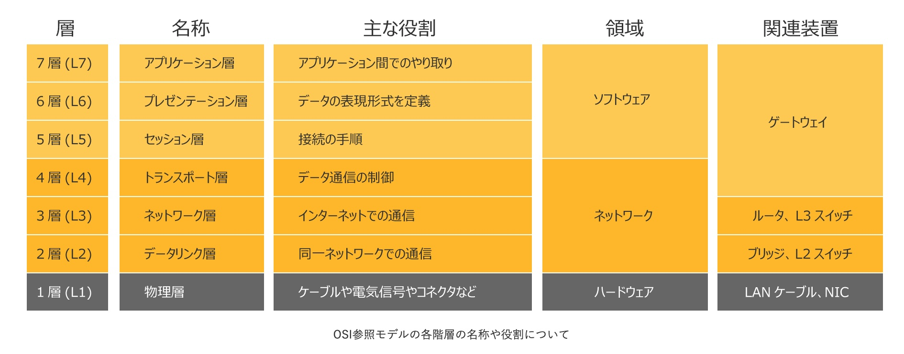
* 役割ごとに階層が分かれている
* 下の層がハードウェアに近い

---
<!--
_footer: "" 
-->

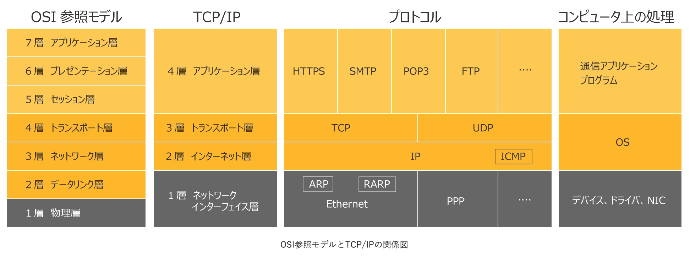

---
<!--
_footer: "" 
-->

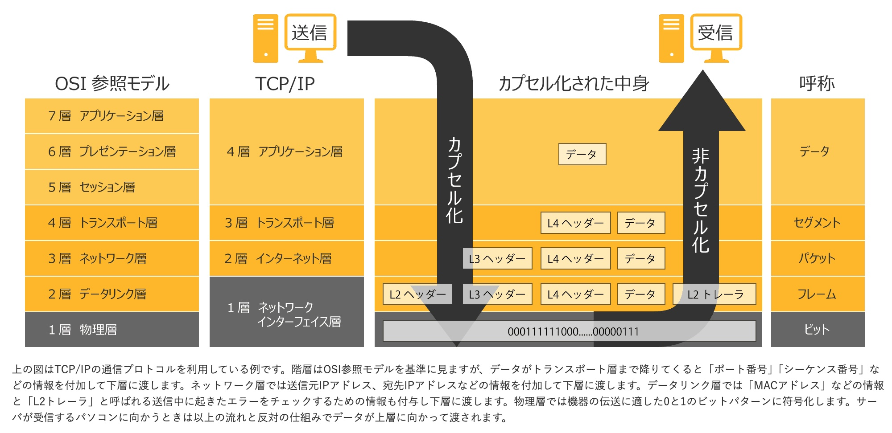
* 上の階層ほど抽象的。目的・知識・Why。
* 下の階層ほど具体的。目的を達成する手段・How。

# デザインパターンとは何か?
<!--
_footer: "" 
-->
デザインパターンの1枚絵

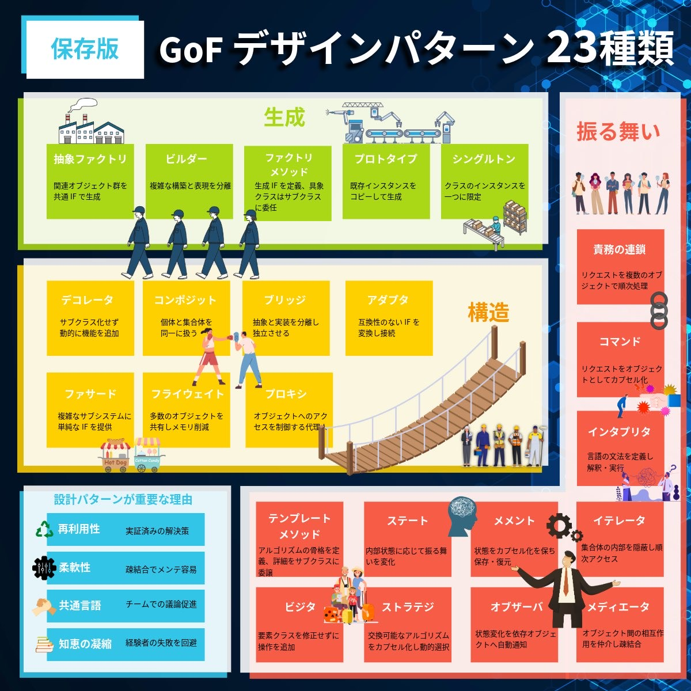

[渡邉 臣@プログラミング勉強法 | JISOU](https://x.com/Sicut_study)の[Xのポスト](https://x.com/sicut_study/status/1985842062533726394?s=46&t=N-VB4uGIa7JGJN67cQZUSQ)より引用

---
<!--
_footer: "" 
-->

* 設計の古典、教科書ともいえる。
* プログラミング言語の中に取り込まれて、見えない。
　
　→　学ぶことは意味があると考える。
　→　開発時のコミュニケーションに活用する。
　ここは「xxx」パターンを適用してみようか?


# デザインパターンの学び方のススメ
<!--
_footer: "" 
-->
* デザインパターンがどんな課題を解決できて、どのような構成なのかイメージを捉える
  * 参考資料1の章題はデザインパターンを短く端的に表現している。
  * 参考資料3では各デザインパターンを短く、わかりやすく解説してくれている。

---
<!--
_footer: "" 
-->
* クラス図とコードの写経をセットで行う
  * コードだけ見ていても各クラスの全体の関係性がわかりずらい。クラス図だけを見ていても抽象的で本当に動くのか疑問がわく。

  * 設計図（抽象）　⇔　コード（具体的）の世界を行ったり来たりすることで整理できたり、気づきが得られることがあると思う。

  * 今回のサンプルコードはJava。デザインパターンの考え方・実装は特定のプログラミング言語に限定されないと思うので自分が得意な言語で実装してみると理解が深まると思う。
  参考資料2ではC#、 C++、 Go、 Java、 PHP、 Python、 Ruby、 Rust、 Swift、 TypeScriptで実装例を提示してくれている。

---
<!--
_footer: "" 
-->
* デザインパターンに登場するクラスの相互関係に注目する
  * 複数のクラスが関係してパターンを構成している。各クラスの役割、関係性に注目する。

* デザインパターンがどのように振る舞うか?に加えて、デザインパターンはどのように使われるか?の視点も大事だと思う。

# Factory Method
<!--
_footer: "" 
-->
* 参考資料1　章題　【インスタンス作成をサブクラスにまかせる】
* インスタンス作成するクラスを用意する（あちこちでインスタン作成せずに、インスタンス作成役に任せる）。

---
<!--
_footer: "" 
-->
サンプルプログラムのクラス図


サンプルプログラムのディレクトリ
https://github.com/grace2riku/design_pattern_lesson_2025/tree/main/Factory_Method

---
<!--
_footer: "" 
-->
サンプルプログラムのビルド方法
サンプルプログラムのディレクトリ（Main.javaがあるディレクトリ）に移動しつぎのコマンドでビルドする。

```
$ javac Main.java 
```

プログラムの実行はつぎのコマンドで行う。
```
$ java Main 
```

---
<!--
_footer: "" 
-->
Factory Methodサンプルプログラムの実行結果

```
$ java Main
/***** IDCardのFactory *****/
Hiroshi Yukiのカードを作ります。
IDCard [owner=Hiroshi Yuki]を登録しました。
Tomuraのカードを作ります。
IDCard [owner=Tomura]を登録しました。
Hanako Satoのカードを作ります。
IDCard [owner=Hanako Sato]を登録しました。
IDCard [owner=Hiroshi Yuki]を使います。
IDCard [owner=Tomura]を使います。
IDCard [owner=Hanako Sato]を使います。

/***** BussinesCardのFactory *****/
Koji Abeの名刺を作ります。
BusinessCard [owner=Koji Abe]を登録しました。
Riku Abeの名刺を作ります。
BusinessCard [owner=Riku Abe]を登録しました。
BusinessCard [owner=Koji Abe]を使います。
BusinessCard [owner=Riku Abe]を使います。
```

---
<!--
_footer: "" 
-->
Factory Methodサンプルプログラムの実行結果

* IDCardのFactoryは参考資料1のサンプルコード
* BussinesCardのFactoryは今回追加した名刺のFactoryと商品の名刺
* フレームワークのパッケージ内は変更せず、具体的な工場・商品の追加で新しい種類のインスタンス作成ができた

---
<!--
_footer: "" 
-->
Factory_Methodパターンの登場人物を抽象的に書く


---
<!--
_footer: "" 
-->
Factory_Methodパターンの使いところ

* インスタンス生成を専門にするクラスを用意することでコードを整理できる
工場を使えばインスタンスを作成できる。

---
<!--
_footer: "" 
-->
static Factory Method
> 参考資料1より引用

* インスタンス生成のためのクラスメソッド（クラスをインスタンス化しなくても呼び出し可能なメソッド）

* GoFのFactory Methodパターンと違うが、インスタンス生成でよく使われる手法。
（個人的に開発シーンでFactoryと呼ぶときはこちらを指すことが多いと思っている）

---
<!--
_footer: "" 
-->
static Factory Method

* javaのAPIのstatic Factory Methodとして参考資料1で紹介されているものは以下のとおり
  * java.security.SecureRandomのgetInstanceメソッド
  * java.util.Listのofメソッド 
  * java.util.ArraysのasListメソッド 
  * java.lang.StringのvalueOfメソッド 
  * java.time.Instantのnowメソッド 


# Singleton
<!--
_footer: "" 
-->
* 参考資料1　章題　【たった1つのインスタンス】
* システムにインスタンスが1つしかないことを保証する。
プログラマがインスタンスを1つしかつくらないように気を付けるのではなく、インスタンスが1つしかつくれないような仕組みにする。

---
<!--
_footer: "" 
-->
システムの中で複数あると困りそうなもの

* プリンタのジョブ管理
* デバイスドライバ
* Factory MethodのFactory

---
<!--
_footer: "" 
-->
Singletonパターンのサンプルプログラム例

テーマ：システムに1つのものを対象にする。今回はプリンタのジョブ

---
<!--
_footer: "" 
-->
サンプルプログラムのクラス図

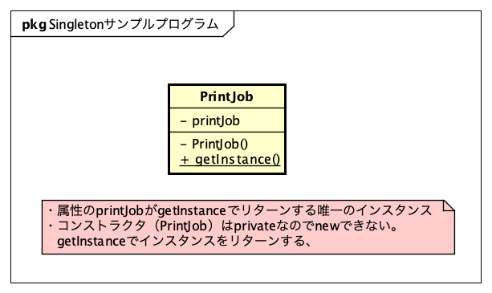

サンプルプログラムのディレクトリ
https://github.com/grace2riku/design_pattern_lesson_2025/tree/main/Singleton/PrintJob


---
<!--
_footer: "" 
-->
サンプルプログラムのビルド方法
サンプルプログラムのディレクトリ（Main.javaがあるディレクトリ）に移動しつぎのコマンドでビルドする。

```
$ javac Main.java 
```

プログラムの実行はつぎのコマンドで行う。
```
$ java Main 
```

---
<!--
_footer: "" 
-->
Singletonサンプルプログラムの実行結果

```
$ java Main
Start.
インスタンスを生成しました。
printjob1とprintjob2は同じインスタンスです。
End.
```

* 「インスタンスを生成しました。」のメッセージが1つなので、インスタンスは1つのみ生成されている。
* getInstanceメソッドで取得したインスタンスは同じことを確認できた

---
<!--
_footer: "" 
-->
Singletonパターンの使いところ

* インスタンスが1つであることを保証したい時
  * 組込みソフトウェアのデバイスドライバなど
  * データベースのアクセス
  * Factory MethodのFactory（インスタンスを作成する工場はひとつでよいことが多いと思う）

---
<!--
_footer: "" 
-->
おまけ：Singletonの実装を変更してみる

サンプルコード：
https://github.com/grace2riku/design_pattern_lesson_2025/tree/main/Singleton/PrintJob_2_1

---
<!--
_footer: "" 
-->
ディレクトリ名：PrintJob_2_1
Singletonのインスタンス生成の実装を下記に変更（インスタンスが生成済みかnullチェックするようにした）
```
public class PrintJob {
    private static PrintJob printJob = null;
    
    private PrintJob() {
        System.out.println("インスタンスを生成しました。");
    }

    public static PrintJob getInstance() {
        if (printJob == null) {
            printJob = new PrintJob();
        }
        return printJob;
    }
}
```

---
<!--
_footer: "" 
-->
サンプルコード：PrintJob_2_1を動かすとSingletonの動きが確認できます。

・・・確認できますが、このコードには
* 考慮していないこと
* 呼び出し方にはよっては意図しない動作をする可能性
があります。

それは何でしょう？

つぎのページを見ずに考えてみてくださいね🙇

---
<!--
_footer: "" 
-->
前ページの解答

* マルチスレッド環境でgetInstanceを実行すると異なるインスタンスを取得してしまう（Singletonでなくなる）

---
<!--
_footer: "" 
-->
PrintJob_2_1をマルチスレッドで実行するように変更したコード（PrintJob_2_2）で動きを確かめてみる

サンプルコード：
https://github.com/grace2riku/design_pattern_lesson_2025/tree/main/Singleton/PrintJob_2_2


---
<!--
_footer: "" 
-->
PrintJob_2_2をコンパイル・実行するとつぎの結果になる。

```
Start
End
インスタンスを生成しました。
インスタンスを生成しました。
インスタンスを生成しました。
PrintJob B: obj = PrintJob@1151bbe3
PrintJob C: obj = PrintJob@7b63961c
PrintJob A: obj = PrintJob@4230a45b
```

* 3つインスタンスをつくっており、異なるインスタンスになっている。
※PC環境によっては結果が異なるかもしれません。私のPCだと毎回異なるインスタンスになりました。


---
<!--
_footer: "" 
-->
何故、Singletonでなくなったのでしょうか?

---
<!--
_footer: "" 
-->
Q. 何故、Singletonでなくなったのでしょうか?
A. このメソッドの条件判断がマルチスレッドで実行されるため

```
    public static PrintJob getInstance() {
        if (printJob == null) {
            printJob = new PrintJob();
        }
        return printJob;
    }
```

---
<!--
_footer: "" 
-->
PrintJob_2_2のコードでSingletonに対応する方法

インスタンス作成部分をマルチスレッド環境から呼び出されても唯一のインスタンスを返すようにする。

参考資料1に書かれていた手法を紹介する。

コード
https://github.com/grace2riku/design_pattern_lesson_2025/tree/main/Singleton/PrintJob_2_3


---
<!--
_footer: "" 
-->
synchronizedを付加する

```
    public static synchronized PrintJob getInstance() {
        if (printJob == null) {
            printJob = new PrintJob();
        }
        return printJob;
    }
```

---
<!--
_footer: "" 
-->
PrintJob_2_3（synchronized）の実行結果

```
$ java Main
Start
End
インスタンスを生成しました。
PrintJob B: obj = PrintJob@386514c2
PrintJob A: obj = PrintJob@386514c2
PrintJob C: obj = PrintJob@386514c2
```

* インスタンスが1個だけ作成されており、Singleton対応できていることが確認できた。
* PrintJobのコードが基本形だと思う。
PrintJobのコードをマルチスレッド環境で実行してもSingleton対応できている。

---
<!--
_footer: "" 
-->
このことから学べるポイント

* どう使われるか?、どう使われる可能性があるか?、を考慮して実装者に任せるのではなく**設計者**が実装者に伝えるようにする。

* スレッドセーフではない実装のまま進める場合は、ドキュメントにスレッドセーフではない旨を書いておいた方が良さそう。


# Strategy
<!--
_footer: "" 
-->
* 参考資料1　章題　【アルゴリズムをごっそり切り替える】
* Strategy: 戦略という意味
* プログラミングの文脈においての戦略　≒　アルゴリズム
*  アルゴリズムを切り替え、同じ問題を別の方法で解くのを容易にするパターン

---
<!--
_footer: "" 
-->
サンプルプログラムのテーマ
[UMTP 組込みモデリング部会](https://umtp-japan.org/activity-report/6846)

組込みモデリングカタログ
部品編 -> **目標制御** をテーマとする。

モデルの概要
* 制御対象の測定値が目標値となるように制御する仕組み
* 目標制御の適用例
  * エアコンの温度制御
  * 自動車の速度制御
  * その他、多種多様多岐に渡る

---
<!--
_footer: "" 
-->
目標制御のモデル解説

参考資料4. [組込み分野のためのUML モデル解説書 部品編 C001 目標制御](https://umtp-japan.org/pdf/built/C001_TargetControl.pdf) 16ページ

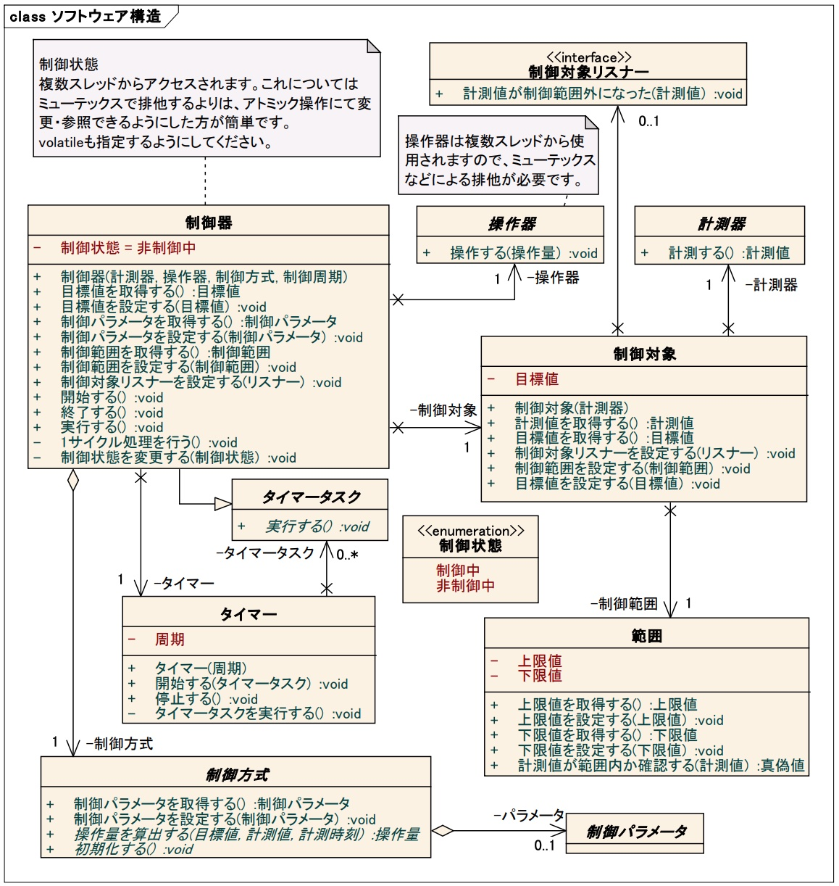

* 目標制御モデルの全体構造

---
<!--
_footer: "" 
-->
目標制御の**制御方式**の解説

参考資料4. [組込み分野のためのUML モデル解説書 部品編 C001 目標制御](https://umtp-japan.org/pdf/built/C001_TargetControl.pdf) 21ページ

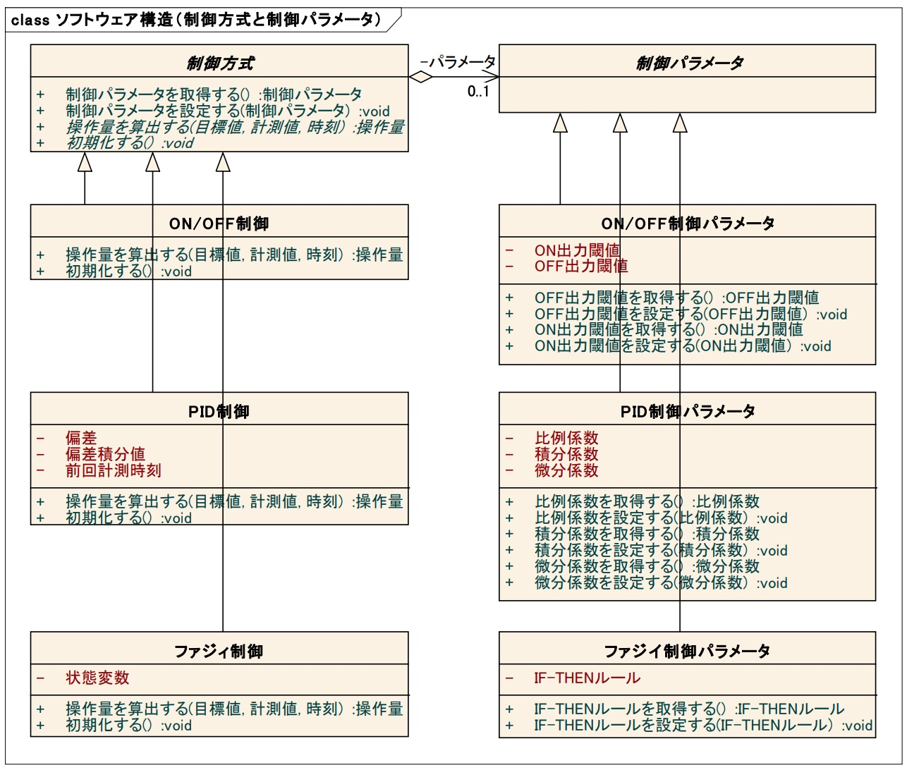

* サンプルプログラムでは制御方式の各制御をStrategyパターンで表現する

---
<!--
_footer: "" 
-->
今回実装したのは図の赤枠のメソッド
* 開始する（start）、初期化（init）
* StrategyパターンでPID制御の部分がON・OFF制御、ファジー制御、機械学習制御のバリエーションになる

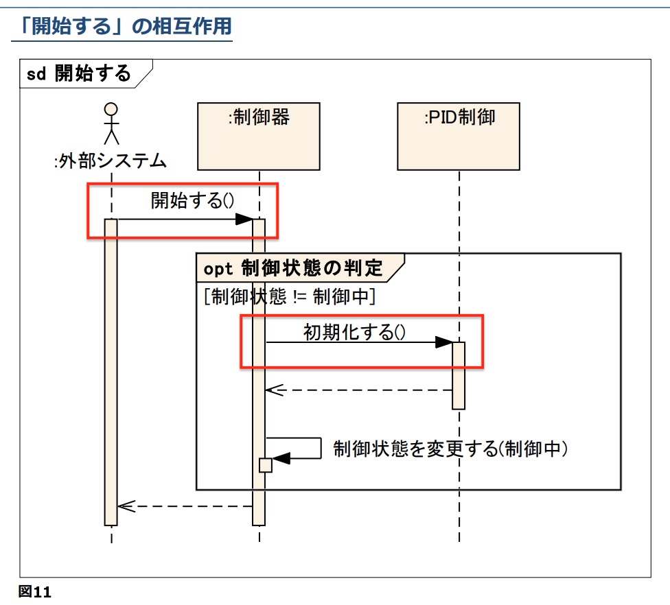

---
<!--
_footer: "" 
-->
今回実装したのは図の赤枠のメソッド
* 実行する（execute）、操作量を算出する（CalcOperationAmount）

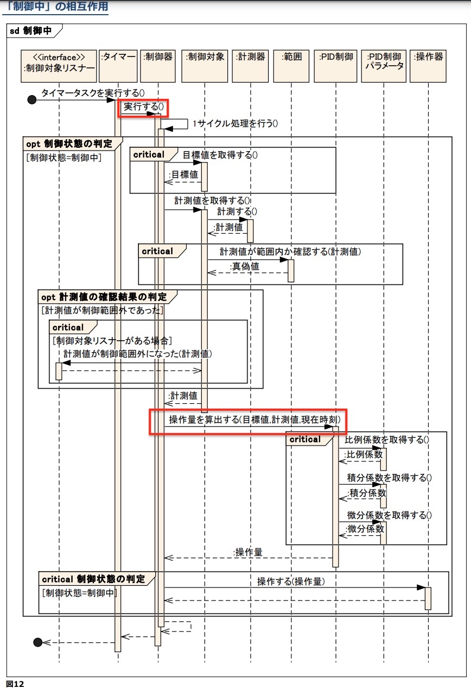

---
<!--
_footer: "" 
-->
今回実装したのは図の赤枠のメソッド
* 終了する（exit）

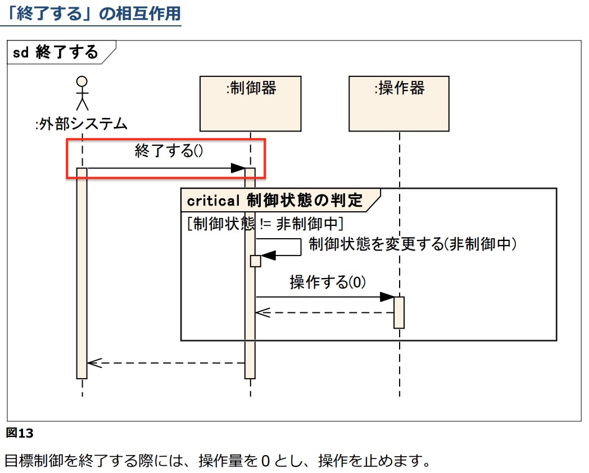


---
<!--
_footer: "" 
-->
サンプルプログラムのクラス図

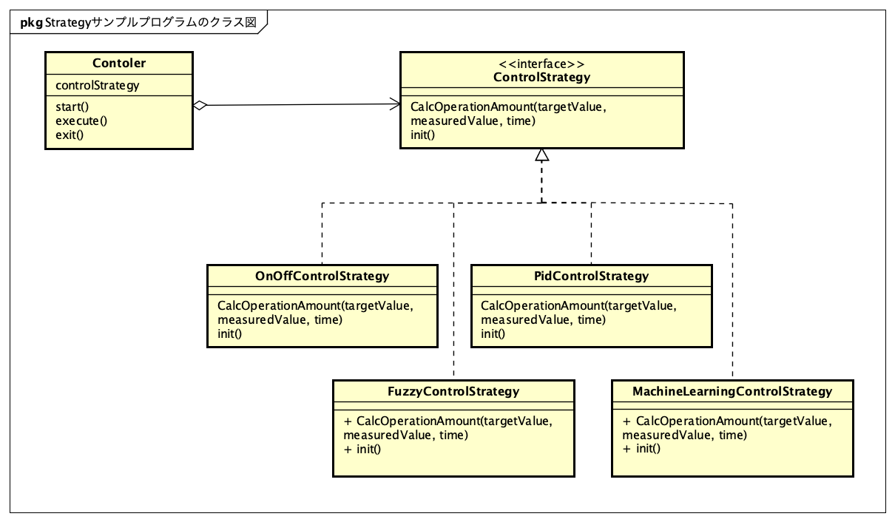

サンプルプログラムのディレクトリ
https://github.com/grace2riku/design_pattern_lesson_2025/tree/main/Strategy

---
<!--
_footer: "" 
-->
各制御方式の詳細
> 参考資料4. [組込み分野のためのUML モデル解説書 部品編 C001 目標制御](https://umtp-japan.org/pdf/built/C001_TargetControl.pdf) 34ページより引用

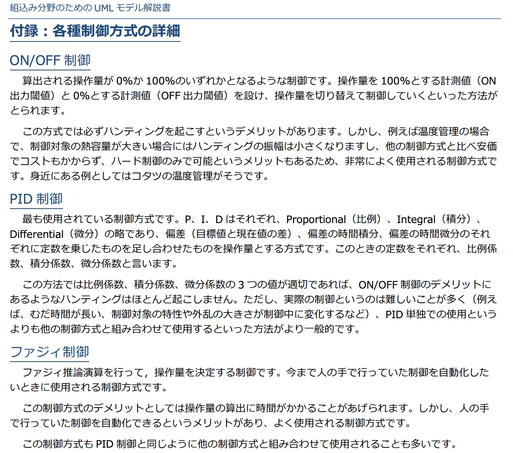


---
<!--
_footer: "" 
-->

Strategyパターンとビジネス活動の連携の例

| 制御方式 | 実装コスト | 将来性 | Strategy適用例 |
| :--- | :--- | :--- | :--- |
| ON・OFF制御 | 低 | × | 社内ハード屋さん確認用にすぐリリースする |
| PID制御 | 中 | × | 1stリリース |
| ファジィ制御 | 高 | △ | 2ndリリース |
| 機械学習制御 | 中 | ○ | ・販促。AI・機械学習と打ち出すと売れる（かもしれない）<br>・上位機種 |

---
<!--
_footer: "" 
-->
**注意**

* 今回Javaで目標制御のサンプルプログラムを書いたが、あくまでStrategyパターンを学ぶためのサンプルプログラム
* ガベージコレクションがいつ実行されるかわからないJavaでリアルタイム性が求められる制御を普通はしない。

---
<!--
_footer: "" 
-->
サンプルプログラムのビルド方法
サンプルプログラムのディレクトリ（Main.javaがあるディレクトリ）に移動しつぎのコマンドでビルドする。

```
$ javac Main.java 
```

プログラムの実行は制御方式の引数を指定する（つぎはON・OFF制御の場合）。
```
$ java Main onoff
```

---
<!--
_footer: "" 
-->
制御方式の引数の組合せ

| 制御方式 | 引数 | コマンド |
| :--- | :--- | :--- |
| ON・OFF制御 | onoff | java Main onoff |
| PID制御 | pid | java Main pid |
| ファジィ制御 | fuzzy | java Main fuzzy |
| 機械学習制御 | ml | java Main ml |


---
<!--
_footer: "" 
-->
サンプルプログラムの実行結果

ON・OFF制御の実行結果
```
$ java Main onoff
OnOff制御を開始します...
OnOffControlStrategy init
OnOffControlStrategy CalcOperationAmount
```

PID制御の実行結果
```
$ java Main pid
PID制御を開始します...
PidControlStrategy init
PidControlStrategy CalcOperationAmount
```
---
<!--
_footer: "" 
-->

ファジー制御の実行結果
```
$ java Main fuzzy
ファジー制御を開始します...
FuzzyControlStrategy init
FuzzyControlStrategy CalcOperationAmount
```

機械学習制御の実行結果
```
$ java Main ml
機械学習制御を開始します...
MachineLearningControlStrategy init
MachineLearningControlStrategy CalcOperationAmount
```

---
<!--
_footer: "" 
-->
Strategyパターンの登場人物を抽象的に書く

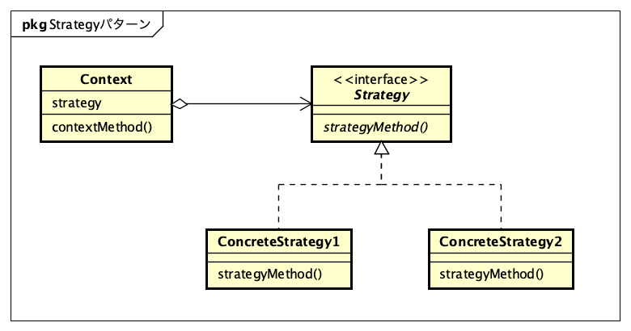

---
<!--
_footer: "" 
-->
Strategyパターンのまとめ

* アルゴリズムの切り替えを容易にする
* 動的にアルゴリズムを切り替えてもよい
* Strategyごとに開発メンバーをアサインし、パラレルで開発が進められたりできそう
* ソフトウェア設計だけではなく、ビジネスの戦略としても使えそう

# Facade
<!--
_footer: "" 
-->
* 参考資料1　章題　【シンプルな窓口】
* Facadeのクラスはクラインアントにシンプルな処理の窓口を提供する。
* Facadeのクラスはシステム内部のクラスを正しく利用する（システム内部のクラスの依存関係を理解・把握し、正しい処理の順番で実行する）。システム内部のごちゃごちゃをクライアントに見せない。

---
<!--
_footer: "" 
-->
サンプルプログラム例
テーマ：参考資料1のWebページ（ユーザ名を表示するシンプルなもの）を作成するプログラム。
Webページは以下の構造を持つ。
* タイトル
* 段落
* リンク
* メールアドレスのリンク


---
<!--
_footer: "" 
-->
サンプルプログラムのクラス図

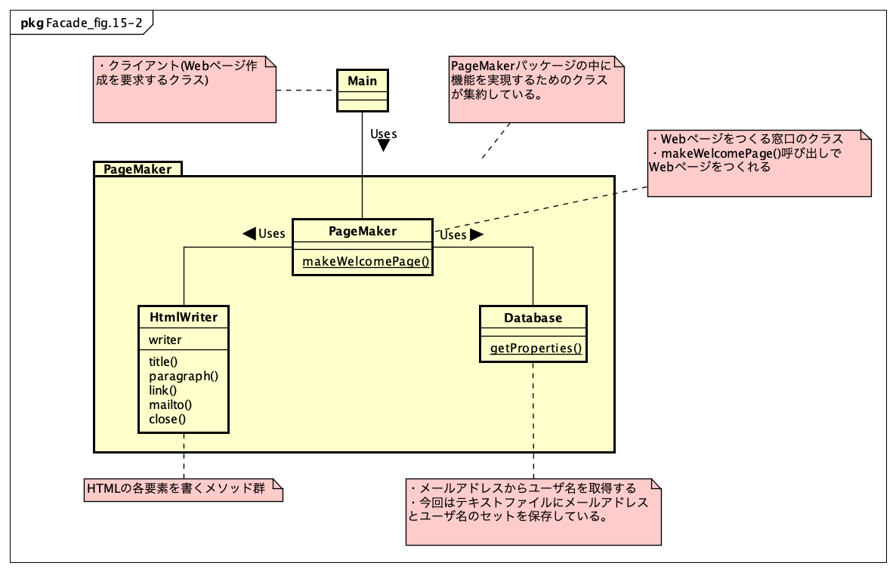

サンプルプログラムのディレクトリ

https://github.com/grace2riku/design_pattern_lesson_2025/tree/main/Facade

---
<!--
_footer: "" 
-->
サンプルプログラムのビルド方法
サンプルプログラムのディレクトリ（Main.javaがあるディレクトリ）に移動しつぎのコマンドでビルドする。

```
$ javac Main.java 
```

プログラムの実行はつぎのコマンドで行う。
```
$ java Main 
```

---
<!--
_footer: "" 
-->
サンプルプログラムの実行結果

```
$ java Main
welcome.html is created for k-abe@example.com (Koji Abe)
```

welcome.htmlの内容
```html
<!DOCTYPE html><html><head><title>Koji Abe's web page</title></head>
<h1>Koji Abe's web page</h1>
<p>Welcome to Koji Abe's web page!</p>
<p>Nice to meet you!</p>
<p><a href="mailto:k-abe@example.com">Koji Abe</a></p>
</body></html>
```

---
<!--
_footer: "" 
-->
welcome.htmlをブラウザで表示したところ

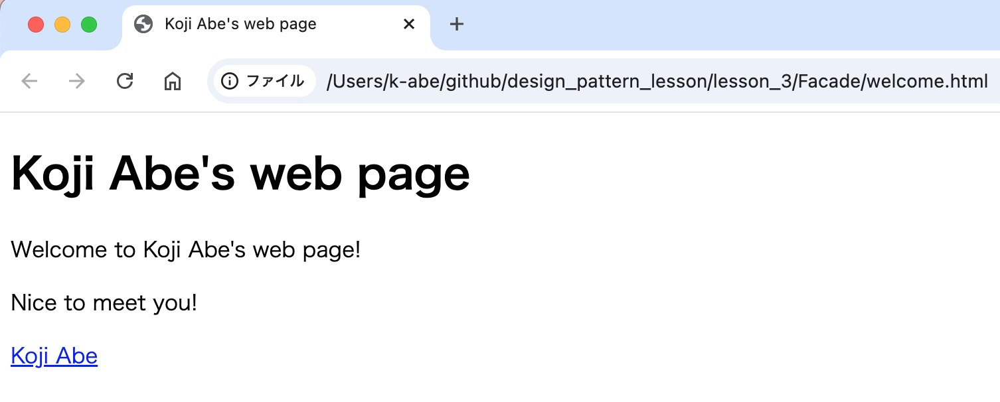

---
<!--
_footer: "" 
-->
サンプルプログラムの解説
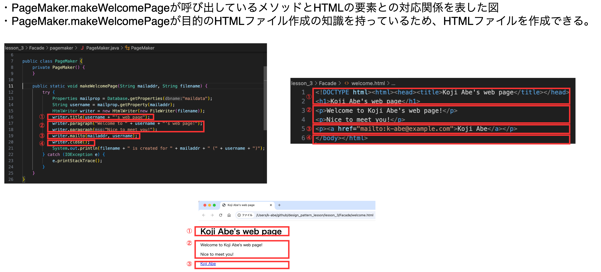


---
<!--
_footer: "" 
-->
Facadeパターンの登場人物を抽象的に書く

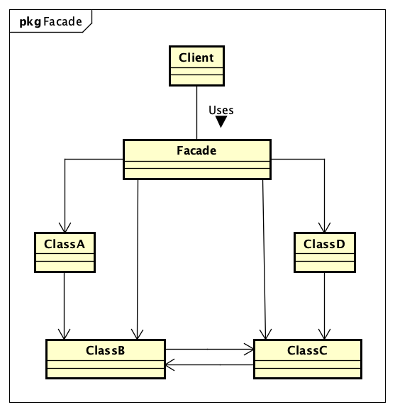

---
<!--
_footer: "" 
-->
Facadeパターンのまとめ

* システム内部の複雑さを単純にできる
* シンプルな窓口を提供する→外部との結合が疎になる→部品として再利用できる


# Observer
<!--
_footer: "" 
-->
* 参考資料1　章題　【状態の変化を通知する】
* observerは、観察(observe)する人、観察者という意味とのこと
* 観察対象の状態が変化したことを観察者に通知する。状態変化に応じた処理を記述するときに便利
* Publish-Subscribeパターン（出版-購読）と呼ばれることもあるらしい。

---
<!--
_footer: "" 
-->
ROS2のPublish-Subscriber通信
> https://docs.ros.org/en/humble/Tutorials/Beginner-CLI-Tools/Understanding-ROS2-Topics/Understanding-ROS2-Topics.html


---
<!--
_footer: "" 
-->
サンプルプログラムの例
テーマ: 数(0〜49のランダムな整数を20個)をObserverに通知する。通知を受けたObserverはそれぞれの方法で数を表示する。
* Observer 1. DigitObserverは数字で数を表示する
* Observer 2. GraphObserverはグラフ(*)で数を表示する


---
<!--
_footer: "" 
-->
サンプルプログラムのクラス図

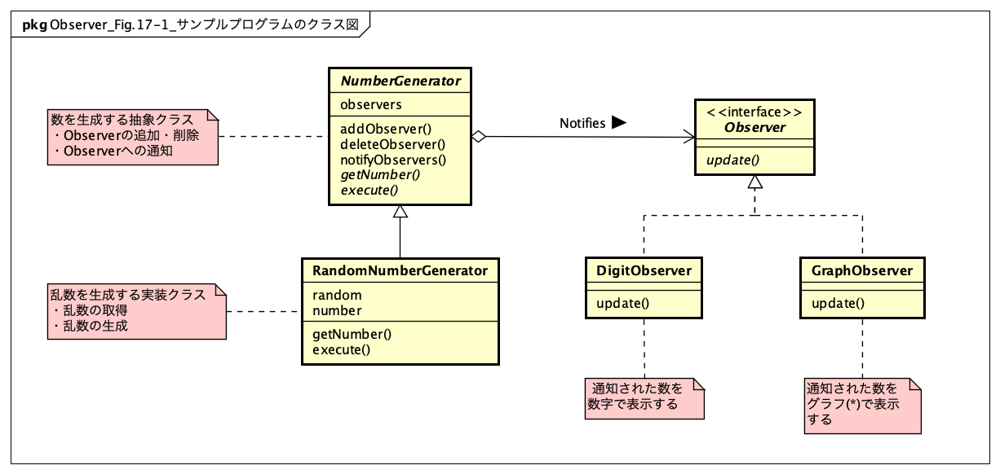

サンプルプログラムのディレクトリ
https://github.com/grace2riku/design_pattern_lesson_2025/tree/main/Observer

---
<!--
_footer: "" 
-->
サンプルプログラムのビルド方法
サンプルプログラムのディレクトリ（Main.javaがあるディレクトリ）に移動しつぎのコマンドでビルドする。

```
$ javac Main.java 
```

プログラムの実行はつぎのコマンドで行う。
```
$ java Main 
```

---
<!--
_footer: "" 
-->
サンプルプログラムの実行結果
DigitObserverとGraphObserverの表示の組が20個あるが省略

```
$ java Main
DigitObserver:9
GraphObserver:*********
DigitObserver:13
GraphObserver:*************
DigitObserver:30
GraphObserver:******************************
DigitObserver:23
GraphObserver:***********************
DigitObserver:34
GraphObserver:**********************************
```

---
<!--
_footer: "" 
-->
サンプルプログラムの解説

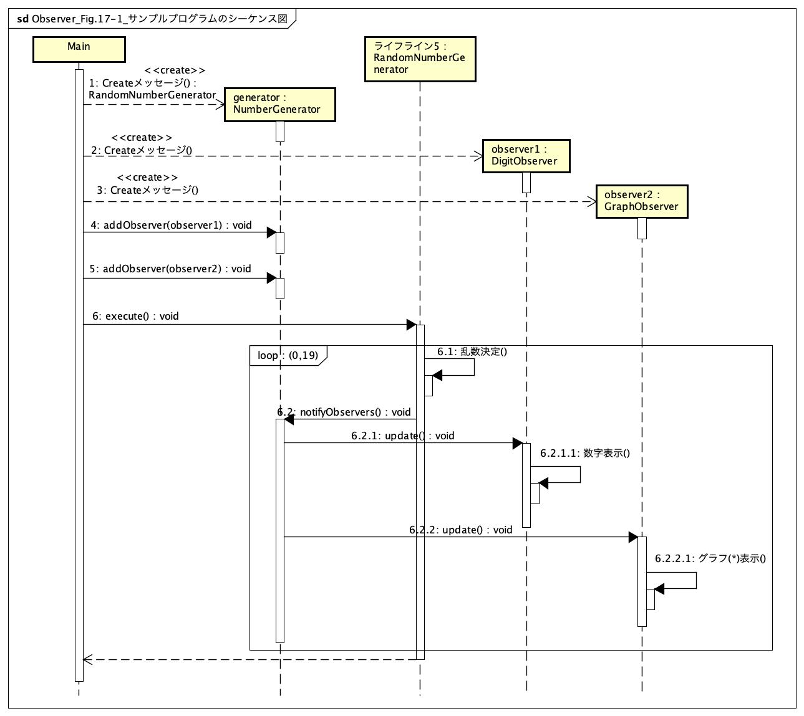


---
<!--
_footer: "" 
-->
Observerパターンのまとめ

* 状態変化を通知するときに使うと便利なパターン
* 通知を出す側はObserverのことを知らない。RandomNumberGeneratorはObserverがDigitObserverかGraphObserverか知らない。
* Observerは通知を出す側を知らない。DigitObserver・GraphObserverはRandomNumberGeneratorが通知を出していることを知らない。
→知らないということはクラスを交換できる→変更容易性を高める設計ができる


# State
<!--
_footer: "" 
-->
* 参考資料1　章題　【状態をクラスとして表現する】
* クラスを切り替えると状態の変化を表せる→どんな良いことがあるかは後述します

---
<!--
_footer: "" 
-->
Stateパターンのサンプルプログラム例
テーマ：参考資料1の金庫警備システム


---
<!--
_footer: "" 
-->
サンプルプログラムのクラス図

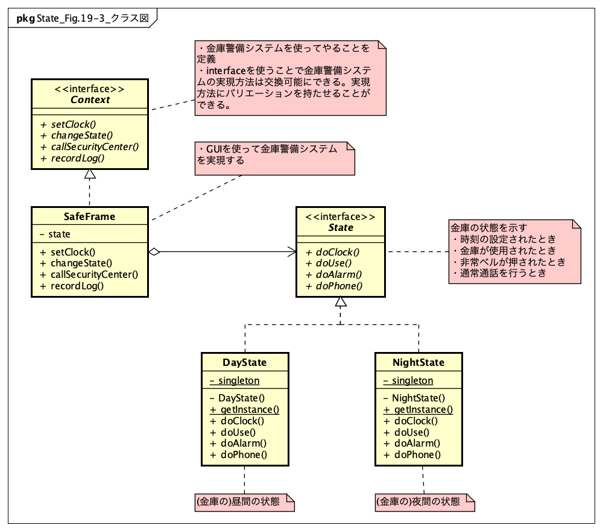

サンプルプログラムのディレクトリ
https://github.com/grace2riku/design_pattern_lesson_2025/tree/main/State


---
<!--
_footer: "" 
-->
サンプルプログラムのビルド方法
サンプルプログラムのディレクトリ（Main.javaがあるディレクトリ）に移動しつぎのコマンドでビルドする。

```
$ javac Main.java 
```

プログラムの実行はつぎのコマンドで行う。
```
$ java Main 
```

---
<!--
_footer: "" 
-->
Stateサンプルプログラムの実行結果
* ターミナルの表示。1秒で1時間経過するようになっている。

```
$ java Main
現在時刻は00:00
[昼間]から[夜間]へ状態が変化しました。
現在時刻は01:00
現在時刻は02:00
現在時刻は03:00
現在時刻は04:00
現在時刻は05:00
現在時刻は06:00
java.awt.event.ActionEvent[ACTION_PERFORMED,cmd=金庫使用,when=1737462816012,modifiers=Button1] on button0
現在時刻は07:00
java.awt.event.ActionEvent[ACTION_PERFORMED,cmd=非常ベル,when=1737462817221,modifiers=Button1] on button1
現在時刻は08:00
java.awt.event.ActionEvent[ACTION_PERFORMED,cmd=通常通話,when=1737462818118,modifiers=Button1] on button2
現在時刻は09:00
[夜間]から[昼間]へ状態が変化しました。
現在時刻は10:00
```

---
<!--
_footer: "" 
-->
* GUIの表示。金庫・非常ベル・電話の使用で昼間・夜間の状態に応じたメッセージが表示される。


---
<!--
_footer: "" 
-->
* サンプルプログラムの解説の前にStateパターンを使わない場合（状態をクラスとしない場合）、昼間・夜間で金庫・非常ベル・電話の使用時の振る舞いをどう実装するか考えてみましょう。

---
<!--
_footer: "" 
-->
* Stateパターンを使わない場合（状態をクラスとしない場合）にありそうな実装例

```java
  金庫使用時に呼ばれるメソッド() {
    if (昼間) {
      // 警備センターに利用の記録
    } else if (夜間) {
      // 警備センターに非常事態の通報
    }
  }

  // 非常ベル、通常通話使用時のメソッドは省略
```

* メソッドの中に状態のif文がある→コードが複雑になる要因のひとつ

---
<!--
_footer: "" 
-->
* Stateパターンを使わない場合（状態をクラスとしない場合）にありそうな実装例
もし、【メンテナンス中】の状態が追加されたらどうなる???

```diff_java
  金庫使用時に呼ばれるメソッド() {
    if (昼間) {
      // 警備センターに利用の記録
    } else if (夜間) {
      // 警備センターに非常事態の通報
    } else if (メンテナンス中) {
      // メンテナンス中の振る舞い
    }
  }

  // 非常ベル、通常通話使用時のメソッドも同様に状態を追加する
```

---
<!--
_footer: "" 
-->
サンプルプログラムの解説

Stateパターン(DayState, NightState)では前ページの実装と違い、**Stateパターンのクラスの中に**必要な振る舞い

* doClock
* doUse
* doAlarm
* doPhone

が書かれており、状態判断のif文が登場しない。
Stateパターンは状態の追加に前述の実装例より容易に対応できる。

---
<!--
_footer: "" 
-->
サンプルプログラムの解説

つぎの場合のシーケンス図
* 昼間に金庫を使用した場合(DayStateのdoUseを呼び出し)
* 時間経過で昼間から夜間になった後に金庫を使用した場合(NightStateのdoUseを呼び出し)

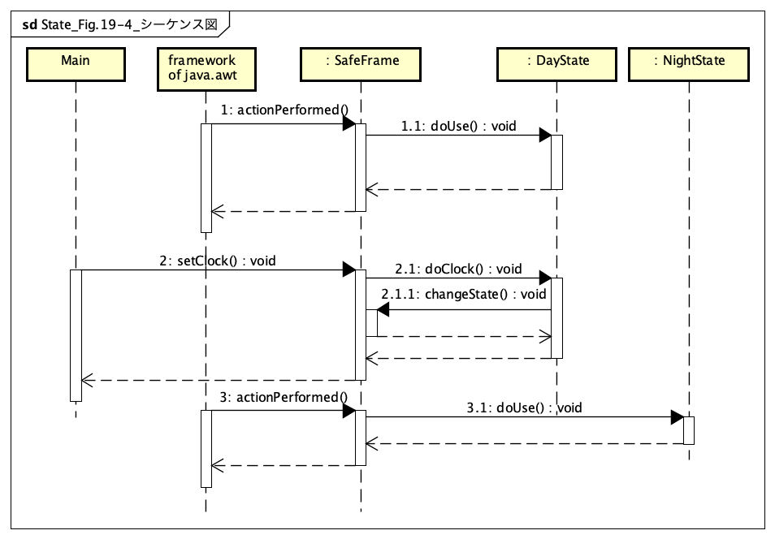

---
<!--
_footer: "" 
-->
サンプルプログラムの解説

DayState, NightStateはSingletonパターンを適用し、インスタンスが1個しか生成できないようにしている。
プログラムを複雑化させない良いアプローチだと思う。

---
<!--
_footer: "" 
-->
Stateパターンのまとめ

* 状態をクラスとして表現した。クラスの中に必要な処理を書いた。結果、状態遷移判定のif文をなくすことができた
* 状態の追加に容易に対応できる変更しやすい構造にできた


# 参考資料
<!--
_footer: "" 
-->
1. [Java言語で学ぶデザインパターン入門　第3版](https://www.hyuki.com/dp/)
2. [直撃！デザインパターン](https://refactoring.guru/ja/design-patterns/book)
3. [ぼくにもわかるデザインパターン　第2章 GoFパターン大カタログ ～パターンがみるみる頭にしみこむ～](https://www.ulsystems.co.jp/archives/028.html)
4. [組込み分野のためのUML モデル解説書 部品編 C001 目標制御](https://umtp-japan.org/pdf/built/C001_TargetControl.pdf)


---

ご清聴ありがとうございました🙇